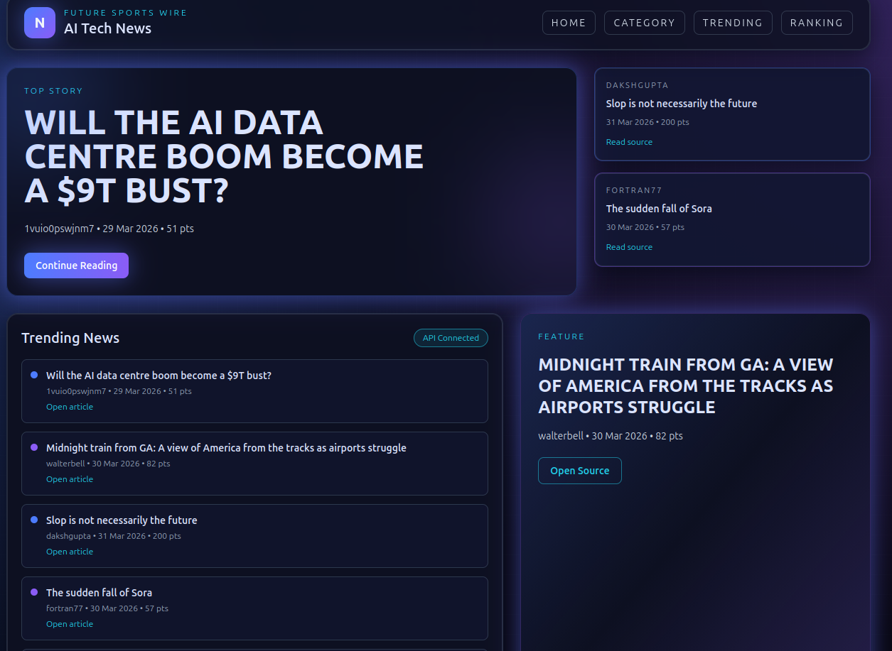
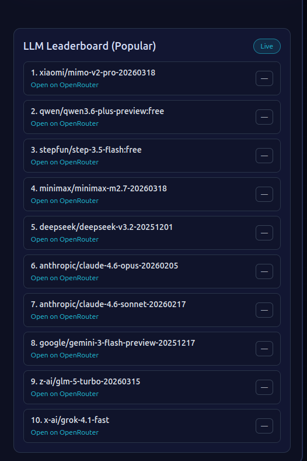

# 🚀 Engineering Portfolio: AI-Driven Infrastructure & Observability

A collection of professional projects focusing on **Cloud-Native Architectures**, **AI Integration**, and **System Reliability**. These projects demonstrate the synergy between modern DevOps practices and Large Language Models (LLMs).

---

## 🏗️ Project 1: AI-Powered Tech News (Event-Driven Cloud Architecture)

A fully automated news aggregation system built on **AWS**, leveraging Serverless computing to provide real-time AI insights with near-zero operational costs.

### **Core Architecture**
* **Edge Layer**: **Amazon CloudFront** acts as a Reverse Proxy and SSL Terminator, using path-based routing to unify Frontend (S3) and Backend (EC2) under a single domain.
* **Automation Layer**: **Amazon EventBridge** triggers **AWS Lambda** functions on a schedule to scrape global AI news and update the LLM leaderboard.
* **Persistence Layer**: **Amazon DynamoDB** (NoSQL) provides sub-millisecond data retrieval for high-concurrency access.
* **Compute Layer**: **Amazon EC2 (Spot Instances)** hosts a Node.js/Express API, utilizing **DuckDNS** for dynamic IP resolution.

### **UI Demo**

Trang web hiển thị tin AI:

Leaderboard LLM (OpenRouter popularity):

---

## 🤖 Project 2: Kubernetes & Rancher AI Documentation Assistant

A specialized documentation platform that transforms static technical guides into an interactive AI-driven experience.

### **Key Innovations**
* **AI-Contextual Search**: Integrated **OpenAI API** to provide natural language answers derived specifically from the internal documentation.
* **Serverless RAG Alternative**: Engineered a custom retrieval mechanism triggered via **OpenAI Function Calling**, optimizing search precision without the overhead of a traditional vector database.
* **React-to-HTML Rendering**: Implemented a novel process to render dynamic React components into flat HTML, ensuring the AI receives perfectly formatted, up-to-date context.
* **Modern UI**: Built with **Docusaurus (React)** for a high-performance, public-facing documentation interface.

---

## 📊 Project 3: Network & Service Observability System

A comprehensive monitoring stack designed for deep visibility into infrastructure health and network performance.

### **Technical Stack & Solutions**
* **Observability Suite**: Deployed and configured **Prometheus, Loki, and Grafana** for a unified "Single Pane of Glass" view of metrics and logs.
* **Custom Exporters (Python & Go)**: 
    * Developed high-stability exporters for **iPerf3** and **Ping**.
    * Implemented a **Queue/Retry mechanism** to handle transient network failures and ensure data integrity during testing.
* **Automated Incident Response**: Integrated **Alertmanager** with **Slack** for real-time alerting.
* **AI-Driven Health Reports**: Leveraged LLMs to automate the analysis of raw monitoring data, generating summarized weekly system health and trend reports.

---

## 🔌 Technical Proficiencies & Protocols

| Category | Technologies |
| :--- | :--- |
| **Cloud Infrastructure** | AWS (S3, EC2, Lambda, CloudFront, DynamoDB), Kubernetes, Rancher. |
| **AI & LLM** | OpenAI API, RAG, Function Calling, AI-Driven Analytics. |
| **Observability** | Prometheus, Grafana, Loki, Alertmanager. |
| **Networking** | TCP/IP, iPerf3, Ping, DNS (DuckDNS), HTTPS/TLS 1.3. |
| **Development** | Node.js, Go, Python, React, Tailwind CSS. |

---

## 📈 Data & Workflow Logic

1. **AI Doc Assistant**: User Query → Function Calling → Custom Search Algorithm → Dynamic HTML Context → AI Synthesis → Final Answer.
2. **Observability**: Custom Exporters → Prometheus/Loki → Grafana Visualization → AI Trend Analysis → Slack Alerting.
3. **News Automation**: EventBridge (Trigger) → Lambda (Scrape & Store) → DynamoDB ← EC2 (API Serving) ← CloudFront (Edge Delivery).
